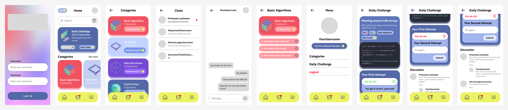

# Meetcode - Program Together
Meetcode is an Android app allowing users to learn programming in byte-sized chunks, via daily questions, and do so together, via direct messaging each other or commenting on questions.
Alongside English, MeetCode supports Portuguese, Korean, Japanese, and Chinese learners through our app localisation which allows you to truly program together like never before.
Custom code blocks mean users can communicate their code effectively.

This project represents over two months of work by:
- Harrison Oates
- Nikhila Gurusinghe
- Alex Boxall
- Geun Yun
- Jayden Skidmore
