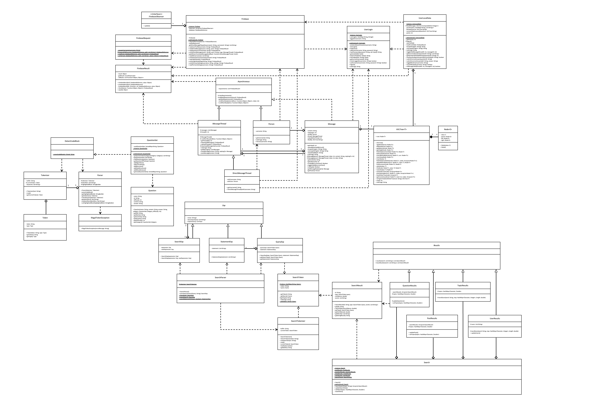

# G11 "Zenith Labs" Report

## Table of Contents

1. [Team Members and Roles](#team-members-and-roles)
2. [Summary of Individual Contributions](#summary-of-individual-contributions)
3. [Conflict Resolution Protocol](#conflict-resolution-protocol)
4. [Application Description](#application-description)
5. [Application UML](#application-uml)
6. [Application Design and Decisions](#application-design-and-decisions)
7. [Summary of Known Errors and Bugs](#summary-of-known-errors-and-bugs)
8. [Testing Summary](#testing-summary)
9. [Implemented Features](#implemented-features)
10. [Team Meetings](#team-meetings)

## Team Members and Roles

| UID              |        Name        |                                                   Role |
|:-----------------|:------------------:|-------------------------------------------------------:|
| u7468248         |    Alex Boxall     |                                 Firebase and Messaging |
| u7469758         |      Geun Yun      |        Data Structures, Authorisation and Localisation |
| u7468212         |   Harrison Oates   |    Syntax Highlighting Design and Parser, Data Streams |
| u7146309         |  Jayden Skidmore   |        Search Grammar Design and Parser, Blocked Users |
| u7300256         | Nikhila Gurusinghe | User Experience & Interface Design, and Implementation |

## Summary of Individual Contributions

u7468248, Alex Boxall: I contributed 20% of the code. Here are my contributions:
* All of [Firebase/Firebase.java](./../MyEducationalApp/app/src/main/java/com/example/myeducationalapp/Firebase/Firebase.java), except ```writeDirectMessagesDatastream```, which was written by Harrison
* All of [Firebase/FirebaseObserver.java](./../MyEducationalApp/app/src/main/java/com/example/myeducationalapp/Firebase/FirebaseObserver.java)
* All of [Firebase/FirebaseRequest.java](./../MyEducationalApp/app/src/main/java/com/example/myeducationalapp/Firebase/FirebaseRequest.java)
* All of [Firebase/FirebaseResult.java](./../MyEducationalApp/app/src/main/java/com/example/myeducationalapp/Firebase/FirebaseResult.java)
* All of [Asynchronous.java](./../MyEducationalApp/app/src/main/java/com/example/myeducationalapp/Asynchronous.java)
* All of [DirectMessageThread.java](./../MyEducationalApp/app/src/main/java/com/example/myeducationalapp/DirectMessageThread.java)
* All of [Message.java](./../MyEducationalApp/app/src/main/java/com/example/myeducationalapp/Message.java)
* All of [MessageThread.java](./../MyEducationalApp/app/src/main/java/com/example/myeducationalapp/MessageThread.java)
* All of [Person.java](./../MyEducationalApp/app/src/main/java/com/example/myeducationalapp/Person.java)
* All of [Question.java](./../MyEducationalApp/app/src/main/java/com/example/myeducationalapp/Question.java)
* All of [QuestionMessageThread.java](./../MyEducationalApp/app/src/main/java/com/example/myeducationalapp/QuestionMessageThread.java)
* All of [UserLocalData.java](./../MyEducationalApp/app/src/main/java/com/example/myeducationalapp/UserLocalData.java)
  * All of [UserLocalDataTest.java](./../MyEducationalApp/app/src/androidTest/java/com/example/myeducationalapp/UserLocalDataTest.java)
* Refactoring of [QuestionSet.java](./../MyEducationalApp/app/src/main/java/com/example/myeducationalapp/QuestionSet.java)
  * Geun wrote the initial version and I refactored it, including making Question its own class
* Some of [UserLogin.java](./../MyEducationalApp/app/src/main/java/com/example/myeducationalapp/UserLogin.java)
  * Geun wrote most of it, and I added ```getCurrentUsername```, ```isUserLoggedIn```, and made changes to ```authoriseUser```
* Summary of contributions:
  * I designed and implemented the code related to Firebase and messaging. This included creating the format of storing the objects on Firebase (which uses a filesystem like-structure with "paths", explained later in the section on features implemented), and away of reading and writing data from it. 
  * I also wrote helper functions for interacting with these low-level objects, such as methods to get the list of all users. 
  * I also wrote classes that could interact with Firebase, such as the Message and DirectMessageThread classes. The allow for messages to be posted, or liked, abstracting the Firebase details away.
  * A difficulty with Firebase is that it is asynchronous, so I also needed to implement a method of running callbacks once the data loaded, as well as callbacks for when an object (such as a DirectMessageThread) had loaded. These include the FirebaseResult class, and its ```.then()``` method, as well as the Asynchronous class with its ```.runWhenReady()``` method
  * I implemented the UserLocalData class, which is responsible for storing data local to a user (e.g. their blocked user list, submitted answers), and ensuring this got synchronised to Firebase (e.g. for when they logout, or use a different device). This also included the need to write serialisation and deserialisation methods so it can be stored on Firebase.
  * I refactored the QuestionSet class and created Question as its own class, as it was previously stored in a string array, and it was a lot cleaner to convert it to its own object
  * I wrote the code for downloading the current messages, adding to them and reuploading them, and the same for liking messages
  * I also implemented parts of the user login, including adding the user accounts on Firebase, and handling special characters in usernames. I also wrote helper functions for getting the currently logged in user. 
  * I also implemented a now-deleted demo user interface that was used to test early versions of the app. When the full UI was ready, this was deleted as it no longer had any use. The old version of the file can still be seen in the Git history [here](https://gitlab.cecs.anu.edu.au/u7468212/ga-23s1-comp2100-6442/-/blob/bcf670bcba30f20b25bcd0e3b4eb955ae66cc5ca/MyEducationalApp/app/src/main/java/com/example/myeducationalapp/MessagingDemoActivity.java).
* What design patterns, data structures, did the involved member propose?
  * I proposed and implemented a number of singleton classes, such as Firebase.Firebase and UserLocalData
  * I also proposed and implemented an observer so the user interface would be able to update itself when something changed on Firebase (e.g. a message was sent between users)
* I also created the UML diagrams for the project
* Which part of the report did the involved member write?
  * This section
  * [FB-Syn] and [P2P-DM] in the 'features implemented' section
  * The section on the instrumented tests


u7469758, Geun Yun: I contributed 20% of the code. Here are my contributions:
* All of [AVLTree.java](./../MyEducationalApp/app/src/main/java/com/example/myeducationalapp/AVLTree.java)
  * All of [AVLTreeTest.java](./../MyEducationalApp/app/src/test/java/com/example/myeducationalapp/AVLTreeTest.java)
* Most of [UserLogin.java](./../MyEducationalApp/app/src/main/java/com/example/myeducationalapp/UserLogin.java) 
  * Most of [UserLoginTest.java](./../MyEducationalApp/app/src/androidTest/java/com/example/myeducationalapp/UserLoginTest.java)
* Most of [QuestionSet.java](./../MyEducationalApp/app/src/main/java/com/example/myeducationalapp/QuestionSet.java)
* Search bar UI part of 
  * [HomeFragment.java](./../MyEducationalApp/app/src/main/java/com/example/myeducationalapp/HomeFragment.java)
  * [fragment_home.xml](./../MyEducationalApp/app/src/main/res/layout/fragment_home.xml)
* All of [LanguageSetting.java](./../MyEducationalApp/app/src/main/java/com/example/myeducationalapp/LanguageSetting.java)
  * Most of
    MyEducationalApp/app/src/main/res/values-pt-rBR/strings.xml
    MyEducationalApp/app/src/main/res/values-zh-rCN/strings.xml
    MyEducationalApp/app/src/main/res/values-ja/strings.xml
    MyEducationalApp/app/src/main/res/values-ko-rKR/strings.xml
* B.class: function1(), function2(), ...
* What design patterns, data structures, did the involved member propose?
  * I was responsible for implementing AVLTree as the data structure which stores xxx
* Specify what design did the involved member propose? What tools were used for the design?
* Which part of the report did the involved member write?
* Were you responsible for the slides?
* You are welcome to provide anything that you consider as a contribution to the project or team.


u7468212, Harrison Oates: I contributed 20% of the code. Here are my contributions:
* All of SyntaxHighlighting.DetectCodeBlock.Class
* All of SyntaxHighlighting.Parser.Class
* All of SyntaxHighlighting.Token.Class
* All of SyntaxHighlighting.Tokenizer.Class
* All of SyntaxHighlightingTest
* All of SyntaxHighlightingParsingTest
* What design patterns, data structures, did the involved member propose?
* Specify what design did the involved member propose? What tools were used for the design?
* Which part of the report did the involved member write?
* Were you responsible for the slides?
* You are welcome to provide anything that you consider as a contribution to the project or team.


u7146309, Jayden Skidmore: I contributed 20% of the code. Here are my contributions:
* A.class
* B.class: function1(), function2(), ...
* What design patterns, data structures, did the involved member propose?
* Specify what design did the involved member propose? What tools were used for the design?
* Which part of the report did the involved member write?
* Were you responsible for the slides?
* You are welcome to provide anything that you consider as a contribution to the project or team.


u7300256, Nikhila Gurusinghe: I contributed 20% of the code. Here are my contributions:
* All of [LoginActivity.java](./../MyEducationalApp/app/src/main/java/com/example/myeducationalapp/LoginActivity.java)
* All of [MainActivity.java](./../MyEducationalApp/app/src/main/java/com/example/myeducationalapp/MainActivity.java)
* All of [AccountFragment.java](./../MyEducationalApp/app/src/main/java/com/example/myeducationalapp/AccountFragment.java)
* All of [CategoriesListFragment.java](./../MyEducationalApp/app/src/main/java/com/example/myeducationalapp/CategoriesListFragment.java)
* Most of [DirectMessageFragment.java](./../MyEducationalApp/app/src/main/java/com/example/myeducationalapp/DirectMessageFragment.java)
  * Alex added scrolling the LinearLayout to the bottom and suggested and implemented long clicking to like direct messages
* Most of [HomeFragment.java](./../MyEducationalApp/app/src/main/java/com/example/myeducationalapp/HomeFragment.java)
  * Geun implemented all the search bar UI and functionality
* All of [MessagesFragment.java](./../MyEducationalApp/app/src/main/java/com/example/myeducationalapp/MessagesFragment.java)
* All of [QuestionFragment.java](./../MyEducationalApp/app/src/main/java/com/example/myeducationalapp/QuestionFragment.java)
* All of [UserInterfaceManager.java](./../MyEducationalApp/app/src/main/java/com/example/myeducationalapp/userInterface/UserInterfaceManager.java)
* All of [UserInterfaceManagerViewModel.java](./../MyEducationalApp/app/src/main/java/com/example/myeducationalapp/userInterface/UserInterfaceManagerViewModel.java)
* All of [CategoryListCard.java](./../MyEducationalApp/app/src/main/java/com/example/myeducationalapp/userInterface/Generation/CategoryListCard.java)
* All of [CategoryQuestionCard.java](./../MyEducationalApp/app/src/main/java/com/example/myeducationalapp/userInterface/Generation/CategoryQuestionCard.java)
* All of [DiscussionElement.java](./../MyEducationalApp/app/src/main/java/com/example/myeducationalapp/userInterface/Generation/DiscussionElement.java)
* All of [HomeCategoryCard.java](./../MyEducationalApp/app/src/main/java/com/example/myeducationalapp/userInterface/Generation/HomeCategoryCard.java)
* All of [MessagesListCard.java](./../MyEducationalApp/app/src/main/java/com/example/myeducationalapp/userInterface/Generation/MessagesListCard.java)
* All of [QuestionCategoriesCard.java](./../MyEducationalApp/app/src/main/java/com/example/myeducationalapp/userInterface/Generation/QuestionCategoriesCard.java)
* All of [GeneratedUserInterfaceViewModel.java](./../MyEducationalApp/app/src/main/java/com/example/myeducationalapp/userInterface/Generation/GeneratedUserInterfaceViewModel.java.java)
* Most of [drawable](./../MyEducationalApp/app/src/main/res/drawable) resource folder
* All of [font](./../MyEducationalApp/app/src/main/res/font), [navigation](./../MyEducationalApp/app/src/main/res/navigation), [values](./../MyEducationalApp/app/src/main/res/values) and [anim](./../MyEducationalApp/app/src/main/res/anim) resource folders
* Most of [layout](./../MyEducationalApp/app/src/main/res/layout) resource folder including:
  * All of [activity_login.xml](./../MyEducationalApp/app/src/main/res/layout/activity_login.xml) (aside from localisation)
  * All of [activity_main.xml](./../MyEducationalApp/app/src/main/res/layout/activity_main.xml) (aside from localisation)
  * All of [fragment_account.xml](./../MyEducationalApp/app/src/main/res/layout/fragment_account.xml) (aside from localisation)
  * All of [fragment_categories_list.xml](./../MyEducationalApp/app/src/main/res/layout/fragment_categories_list.xml) (aside from localisation)
  * All of [fragment_category.xml](./../MyEducationalApp/app/src/main/res/layout/fragment_category.xml) (aside from localisation)
  * All of [fragment_direct_message.xml](./../MyEducationalApp/app/src/main/res/layout/fragment_direct_message.xml) (aside from localisation)
  * Most of [fragment_home.xml](./../MyEducationalApp/app/src/main/res/layout/fragment_home.xml) (aside from localisation and search UI implementation which was done by Geun)
  * All of [fragment_messages.xml](./../MyEducationalApp/app/src/main/res/layout/fragment_messages.xml) (aside from localisation)
  * All of [fragment_question.xml](./../MyEducationalApp/app/src/main/res/layout/fragment_question.xml) (aside from localisation)
* What design patterns, data structures, did the involved member propose?
* Specify what design did the involved member propose? What tools were used for the design?
* Which part of the report did the involved member write?
* Were you responsible for the slides?
* You are welcome to provide anything that you consider as a contribution to the project or team.

## Conflict Resolution Protocol

The following conflict resolution protocol was decided on in our first meeting.
- If someone doesn't meet deadlines: Expectation to communicate if any deadline is expected to be missed.  Ask for explanation, how much more time they need. If they can't catch up, work is allocated to rest of team and contribution score is adjusted accordingly.
- If someone gets sick: Take the time off, let everyone know you're sick. We'll try to program in a buffer period to account for this. If sickness is justifiable it will not affect contribution score.
- In the case of disagreements: Civil discussion without talking over each other followed by a vote which bounds the team to that direction, the vote can only be overturned by another vote.
- ChatGPT and other generative AI tools: Don't use it except as a last resort, ask team members before using.
- Communication: use Microsoft Teams messages.


## Application Description

*[What is your application, what does it do? Include photos or diagrams if necessary]*

MeetCode: Program Together

MeetCode is a disruptive new breed of app asking the question: what if a social media application was also about learning programming? 

MeetCode allow users to learn programming in bite-sized chunks, via daily questions, and do so together, via direct messaging each other or commenting on questions.

MeetCode supports Korean, Japanese, and Chinese learners through our app localisation which allows you to truly program together like never before.

**Application Use Cases and or Examples**

*[Provide use cases and examples of people using your application. Who are the target users of your application? How do the users use your application?]*

*Here is an educational application example*

*Target Users: Those who have started learning programming in java*

* *Users can get better understanding of various topics by attempting the daily question.*
* *Users from non-English speaking background can still learn as the app supports localisation with multiple languages.*
* ...

*Targets Users: Those who wish to discuss about programming*

* *Users can mutually interact with each other by direct messaging and comments which in return will benefit them from the progressing collective intelligence.*
* *Users can maintain constructive relationships with others by blocking anyone, who is causing any harm through the interaction.*
* ...


*List all the use cases in text descriptions or create use case diagrams. Please refer to https://www.visual-paradigm.com/guide/uml-unified-modeling-language/what-is-use-case-diagram/ for use case diagram.*

## Application UML
The below UML diagram does not include any of the user interface classes.

 <br>

## Application Design and Decisions

*Please give clear and concise descriptions for each subsections of this part. It would be better to list all the concrete items for each subsection and give no more than `5` concise, crucial reasons of your design. Here is an example for the subsection `Data Structures`:*

**Data Structures**

We used the following data structures in our project:

1. AVL Tree

   * Objective: It is used for storing xxxx for xxx feature.

   * Locations: line xxx in XXX.java, ..., etc.

   * Reasons:

     * Having the property of self-balancing along with the binary search tree guarantees the performance of O(logN) in the worst case for insertion, deletion and searching.
     * Although HashMap may seem more plausible with better time complexity, the AVL Tree can get data in order via inOrderTraversal().

2. Unlike the most operation in the AVL Tree, the deletion was not covered in the lecture, so its implementation will be briefly outlined.
   * The node that is to be deleted first gets searched, similar to the initial search fro the insertion.
   * It then gets deleted accordingly preserving the BST properties depending on the number of children node/s it has.
   * The tree now identifies node/s that violate/s the balance factor rule.
   * Balance the subtree based on the imbalanced nodes, which uses the same method for balancing in the insertion.
   * Note that it is possible that the balancing is required multiple times, unlike the insertion where the whole tree was guaranteed to be AVL Tree after a single balancing.
   * The author believes that it is because the insertion only manipulates the leaf node, while the deletion manipulates any node, which can cause more than one imbalanced path.

**Design Patterns**

We used the following design patterns in our project:

1. Singleton

* Objective: Used for various classes that require only one instance (or 'global' classes). For example, there is one object for managing user logins, the current user's settings, and the Firebase connection.

* Locations: line xxx in XXX.java, ..., etc.

* Reasons:
  *
  * 

2. Facade

3. Observer
* Objective:
* Locations:
* Reasons:
  * ...
  * ...

**Grammar(s)**

Production rules for the search:
    
    <Non-Terminal> ::= <some output>
    <Non-Terminal> ::= <some output>

*[How do you design the grammar? What are the advantages of your designs?]*

Production rules for syntax highlighting:

      TOKENS          ::= KEYWORD | NUMERIC_LITERAL | STRING_LITERAL | IDENTIFIER | NEWLINE | WHITESPACE | PUNCTUATOR | END-GRAMMAR
      KEYWORD         ::= <font color = "orange"> keyword </font> TOKENS
      NUMERIC_LITERAL ::= <font color = "blue"> numeric_literal </font> TOKENS
      STRING_LITERAL  ::= <font color = "green"> string_literal </font> TOKENS 
      IDENTIFIER      ::= <font color = "purple"> identifier </font> TOKENS | identifier TOKENS
      NEWLINE         ::= <br> TOKENS 
      WHITESPACE      ::= (<&nbsp;>)* TOKENS
      PUNCTUATOR      ::= <font color = "purple"> punctuator </font> TOKENS
      END-GRAMMAR     ::= [finish parsing]

      keyword         ::=  abstract |  assert |  boolean |  break    |  byte 
                        |  case   |  catch    |  char    |  continue |  default 
                        |  do     |  double   |  else    |  enum     |  extends 
                        |  final  |  finally  |  float   |  for      |  if 
                        | implements |  import |  instanceof |  int |  interface 
                        |  long |  native |  new |  package |  private |  protected 
                        |  public |  return |  short |  static |  strictfp |  super 
                        | synchronized |  this |  throw |  throws |  transient 
                        |  try |  void |  volatile |  while 

      numeric         ::= \{x | x \in \mathbb{R}, base 10, 2, or 16\}. 
      string literal  ::= "[a-zA-Z]+" | ""
      identifier      ::= [a-zA-Z]+
      punctuator      :=  { | } | ( | ) | [ | ] | . | : | = | - | + | ! | @ | # 
                        | $ | % | ^ | & | * | ; | ' | ~ | < | > | / | \ | | |

   
   This grammar implements a custom-designed syntax highlighter for Java. An advantage of this approach is that it is easily extensible if more complex syntax highlighting is required later, but does not need the full Java specification grammar to create the colours.
   This choice was made because the student is not debugging code in our app, so additional context clues such as wavy red lines under invalid Java syntax is irrelevant, and not a feature of other dynamic syntax highlighting solutions like highlight.js, as the maintainer of that project highlights [here](https://stackoverflow.com/questions/60455635/does-highlight-js-check-syntax-as-well).
   
   The grammar was designed through observing the characteristics of common colour schemes like Dracula and Android Studio's default themes.

*[How do you design the grammar? What are the advantages of your designs?]*

**Tokenizer and Parsers**

Two tokenizers and parses were built...

*[Where do you use tokenisers and parsers? How are they built? What are the advantages of the designs?]*

**Surprise Item**
The surprise item was not implemented.

**Other**

*[What other design decisions have you made which you feel are relevant? Feel free to separate these into their own subheadings.]*

## Summary of Known Errors and Bugs

*[Where are the known errors and bugs? What consequences might they lead to?]*

*Here is an example:*

1. *Bug 1:*

- *A space bar (' ') in the sign in email will crash the application.*
- ...

2. *Bug 2:*
3. ...

*List all the known errors and bugs here. If we find bugs/errors that your team does not know of, it shows that your testing is not thorough.*

## Testing Summary

*[What features have you tested? What is your testing coverage?]*

*Here is an example:*

- *Number of test cases: ...*

- *Code coverage: ...*

- *Types of tests created: ...*

*Please provide some screenshots of your testing summary, showing the achieved testing coverage. Feel free to provide further details on your tests.*

Much of the application relies on Firebase, and therefore much of the program relies on instrumented tests instead of standard unit tests.
Many types of test were created:
- Tests for user logins (```UserLoginTest```) - this tests the following:
  - being able to log in to different user accounts
  - only the correct passwords works to log in a user
  - password salting is working correctly
  - passwords must be strong enough
  - newly created user accounts must have a unique username
  - this in turn also tests various Firebase related functions, including download and uploading data from it
- Tests for user local data (```UserLocalDataTest```) - this tests the following:
  - users and be blocked and unblocked
  - messages can be liked and unliked
  - answers to questions can be submitted
  - the correct number of points is given after answering a question, on the first or second attempts
- Tests for direct messaging (```DirectMessageTest```) - this tests the following:
  - ...

Android Studio does not provide code coverage for instrumented tests, and thus the exact code coverage is not known.
However, by manually inspecting the code, we find that the user login tests gets 100% line coverage of ```Firebase.FirebaseRequest```, approximately 76% of both ```Firebase.FirebaseResult```, and ```UserLogin```. Additionally, 100% of ```UserLocalData``` is tested, split across ```UserLocalDataTest``` (for most methods), and ```DirecteMessageTest``` (for ```loadFromDisk```).


## Implemented Features

*[What features have you implemented?]*

### Basic App
1. [Login]. Description of the feature and your implementation (easy)
    * Class X, methods Z, Y, Lines of code: 10-100
    * Additional description: ...
      <br>
2. [Data Visualization]. Description  ... ...
<br><br>

### General Features
Feature Category: Data Structures <br>
1. [Data-Deletion]. Deletion method of either a Red-Black Tree, AVL tree or B-Tree data structure. The deletion of nodes must serve a purpose within your application. (hard)
   * Class AVLTree, methods delete, findImbalanceDelete, deleteBeforeBalance, balanceSubtree, Lines of code: 53
   * Additional description: ...

Feature Category: Firebase Integration <br>
2. [FB-Persist] Use Firebase to persist all data used in your app. (medium)
   * Class Firebase.Firebase: whole file
   * Class Firebase.FirebaseRequest: whole file
   * Class Firebase.FirebaseResult: whole file
   * Class UserLocalData: whole file
   * Class Asynchronous: whole file
   * Additional description:
     * The entire state of the app is stored on Firebase. This was done to allow for messages to be sent between users and persist. It also allows for messages to be liked, for different users to be search for, etc. The Firebase package is used to provide an asynchronous interface between the rest of the app and the Firebase database. Internally, the app treats Firebase like a filesystem - each object has a value, name (filename) and child objects (folders). The Firebase.FirebaseRequest file is used to abstract away the low level details of resolving these filepath-like paths into a Firebase API object. Firebase.FirebaseResult provides a clean asynchronous interface that allow callbacks to be chained with ```.then()```, or waited on with ```.await()```. Finally, Firebase.Firebase acts as a singleton and a facade, allowing the rest of the program use core functionality such as getting lists of users, notifications when data changes, and messages stored on the server. Additionally, the Asynchronous class is used to allow the other classes in the program act asynchronously, and allow them to wait on each other to receive data before running a callback.
     * Data is local to particular users, such as messages they've liked, their blocked user list, and any answers they've submitted is stored in the UserLocalData class. However, to handle users logging out of the app and back in again, this is also synchronised to Firebase whenever this data changes. This means the user can log in from any device and their data will still be there.
<br>
3. [FB-Syn] Using Firebase or another remote database to store user information and having the app
   updated as the remote database is updated without restarting the application. (hard)
   * Class Firebase.FirebaseRequest: methods A, B, C, lines of code: whole file
   * Class Firebase.FirebaseResult:
   * Class MessageThread:
   * Class DirectMessageThread:
   * Class QuestionMessageThread:
   * Class Asynchronous:
   * Class <some UI stuff>:
   * Additional description: ...

Feature Category: Peer-to-peer messaging <br>
4. [P2P-Block] Provide users with the ability to ‘block’ users, preventing them from direct messaging
   them. (medium)
   * Class UserLocalData: methods A, B, C, lines of code: whole file
   * Class ??? (probably some UI stuff): ...
   * Additional description: ...
<br>
5. [P2P-DM] Provide users with the ability to message each other directly in private. (hard)
   * Class Message: whole file
   * Class DirectMessageThread: whole file
   * Class MessageThread: whole file
   * Additional description:
     * Users are able to direct message each other. This is possible due to the state of the program being stored on Firebase. For each pair of users, there exists a Firebase object that contains all of the messages that they've sent to each other. This gets loaded into the DirectMessageThread class, which inherits from MessageThread (this is done so messages posted under questions can be handled in the same way). Messages can be sent between the users by adding a new message to the list and re-uploading it to Firebase.

Feature Category: Syntax Highlighting (custom, approved as per [here](https://wattlecourses.anu.edu.au/mod/forum/discuss.php?d=870859)) <br>
6. [Custom-Syntax-Highlighting]. Description: The user interface will be able to display snippets of code to the user, with dynamically generated syntax highlighting applied. The syntax of the code will be Java-like. (hard)
   * Class SyntaxHighlighting.???, methods Z, Y, Lines of code: 10-100
   * Class SyntaxHighlighting.???, methods K, L, M, Lines of code: 35-150
   * Additional description: ...

*List all features you have completed in their separate categories with their difficulty classification. If they are features that are suggested and approved, please state this somewhere as well.*

## Team Meetings

*Here is an example (you could start numbering your meetings from 1):*

- *[Team Meeting 1](./meeting1.md)* (1/4)
- *[Team Meeting 2](./meeting2.md)* (20/4)
- *[Team Meeting 3](./meeting3.md)* (27/4)
- *[Team Meeting 4](./meeting4.md)* (7/5)
- *[Team Meeting 5](./meeting5.md)* (14/5)

 
