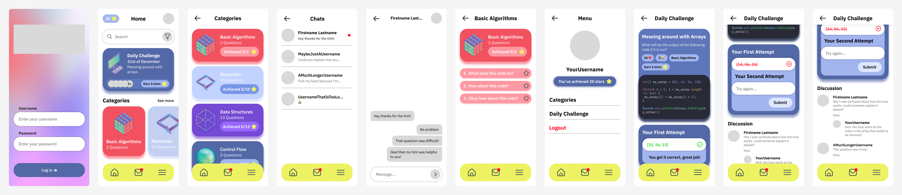
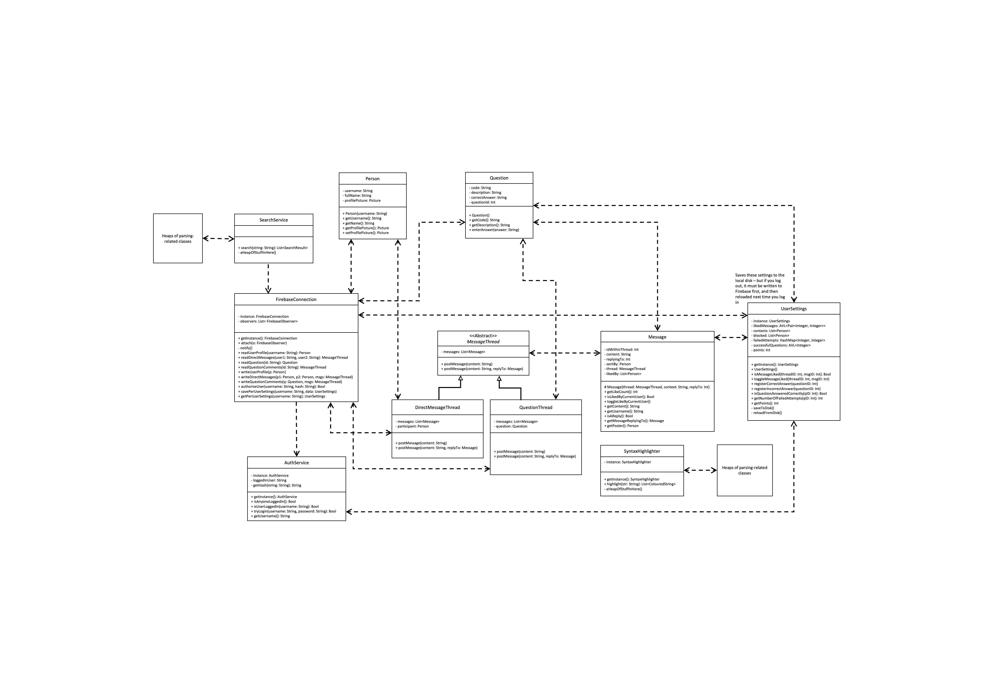
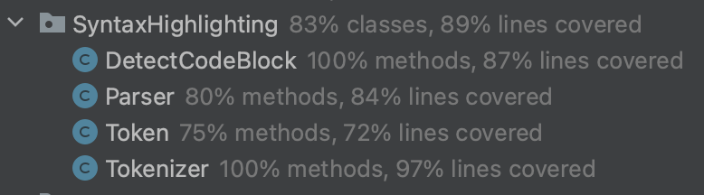

# G11 "Zenith Labs" Report

## Table of Contents

1. [Team Members and Roles](#team-members-and-roles)
2. [Summary of Individual Contributions](#summary-of-individual-contributions)
3. [Conflict Resolution Protocol](#conflict-resolution-protocol)
4. [Application Description](#application-description)
5. [Application UML](#application-uml)
6. [Application Design and Decisions](#application-design-and-decisions)
7. [Summary of Known Errors and Bugs](#summary-of-known-errors-and-bugs)
8. [Testing Summary](#testing-summary)
9. [Implemented Features](#implemented-features)
10. [Team Meetings](#team-meetings)

## Team Members and Roles

| UID              |        Name        |                                                   Role |
|:-----------------|:------------------:|-------------------------------------------------------:|
| u7468248         |    Alex Boxall     |                                 Firebase and Messaging |
| u7469758         |      Geun Yun      |        Data Structures, Authorisation and Localisation |
| u7468212         |   Harrison Oates   |    Syntax Highlighting Design and Parser, Data Streams |
| u7146309         |  Jayden Skidmore   |        Search Grammar Design and Parser, Blocked Users |
| u7300256         | Nikhila Gurusinghe | User Experience & Interface Design, and Implementation |

## Summary of Individual Contributions

u7468248, Alex Boxall: I contributed 20% of the code. Here are my contributions:
* All of [Firebase/Firebase.java](./../MyEducationalApp/app/src/main/java/com/example/myeducationalapp/Firebase/Firebase.java)
* All of [Firebase/FirebaseObserver.java](./../MyEducationalApp/app/src/main/java/com/example/myeducationalapp/Firebase/FirebaseObserver.java)
* All of [Firebase/FirebaseRequest.java](./../MyEducationalApp/app/src/main/java/com/example/myeducationalapp/Firebase/FirebaseRequest.java)
* All of [Firebase/FirebaseResult.java](./../MyEducationalApp/app/src/main/java/com/example/myeducationalapp/Firebase/FirebaseResult.java)
* All of [Asynchronous.java](./../MyEducationalApp/app/src/main/java/com/example/myeducationalapp/Asynchronous.java)
* All of [DirectMessageThread.java](./../MyEducationalApp/app/src/main/java/com/example/myeducationalapp/DirectMessageThread.java)
    * All of [DirectMessageTest.java](./../MyEducationalApp/app/src/androidTest/java/com/example/myeducationalapp/DirectMessageTest.java)
* All of [Message.java](./../MyEducationalApp/app/src/main/java/com/example/myeducationalapp/Message.java)
* All of [MessageThread.java](./../MyEducationalApp/app/src/main/java/com/example/myeducationalapp/MessageThread.java)
* All of [Person.java](./../MyEducationalApp/app/src/main/java/com/example/myeducationalapp/User/Person.java)
* All of [Question.java](./../MyEducationalApp/app/src/main/java/com/example/myeducationalapp/Question/Question.java)
* All of [UserLocalData.java](./../MyEducationalApp/app/src/main/java/com/example/myeducationalapp/User/UserLocalData.java)
  * All of [UserLocalDataTest.java](./../MyEducationalApp/app/src/androidTest/java/com/example/myeducationalapp/UserLocalDataTest.java)
* Refactoring of [QuestionSet.java](./../MyEducationalApp/app/src/main/java/com/example/myeducationalapp/Question/QuestionSet.java)
  * Geun wrote the initial version and I refactored it, including making Question its own class
* Some of [UserLogin.java](./../MyEducationalApp/app/src/main/java/com/example/myeducationalapp/User/UserLogin.java)
  * Geun wrote most of it, and I added ```getCurrentUsername```, ```isUserLoggedIn```, and made changes to ```authoriseUser```
* Summary of contributions:
  * I designed and implemented the code related to Firebase and messaging. This included creating the format of storing the objects on Firebase (which uses a filesystem like-structure with "paths", explained later in the section on features implemented), and away of reading and writing data from it. 
  * I also wrote helper functions for interacting with these low-level objects, such as methods to get the list of all users. 
  * I also wrote classes that could interact with Firebase, such as the Message and DirectMessageThread classes. The allow for messages to be posted, or liked, abstracting the Firebase details away.
  * A difficulty with Firebase is that it is asynchronous, so I also needed to implement a method of running callbacks once the data loaded, as well as callbacks for when an object (such as a DirectMessageThread) had loaded. These include the FirebaseResult class, and its ```.then()``` method, as well as the Asynchronous class with its ```.runWhenReady()``` method
  * I implemented the UserLocalData class, which is responsible for storing data local to a user (e.g. their blocked user list, submitted answers), and ensuring this got synchronised to Firebase (e.g. for when they logout, or use a different device). This also included the need to write serialisation and deserialisation methods so it can be stored on Firebase.
  * I refactored the QuestionSet class and created Question as its own class, as it was previously stored in a string array, and it was a lot cleaner to convert it to its own object
  * I wrote the code for downloading the current messages, adding to them and reuploading them, and the same for liking messages
  * I also implemented parts of the user login, including adding the user accounts on Firebase, and handling special characters in usernames. I also wrote helper functions for getting the currently logged in user. 
  * I also implemented a now-deleted demo user interface that was used to test early versions of the app. When the full UI was ready, this was deleted as it no longer had any use. The old version of the file can still be seen in the Git history [here](https://gitlab.cecs.anu.edu.au/u7468212/ga-23s1-comp2100-6442/-/blob/bcf670bcba30f20b25bcd0e3b4eb955ae66cc5ca/MyEducationalApp/app/src/main/java/com/example/myeducationalapp/MessagingDemoActivity.java).
* What design patterns, data structures, did the involved member propose?
  * I proposed and implemented a number of singleton classes, such as Firebase.Firebase and UserLocalData
  * I also proposed and implemented an observer so the user interface would be able to update itself when something changed on Firebase (e.g. a message was sent between users)
* I also created the UML diagrams for the project
* Which part of the report did the involved member write?
  * This section
  * [FB-Syn] and [P2P-DM] in the 'features implemented' section
  * The section on the instrumented tests
  * Added the UML to the report
  * Added the screenshots for code coverage


u7469758, Geun Yun: I contributed 20% of the code. Here are my contributions:
* All of [AVLTree.java](./../MyEducationalApp/app/src/main/java/com/example/myeducationalapp/AVLTree.java)
  * All of [AVLTreeTest.java](./../MyEducationalApp/app/src/test/java/com/example/myeducationalapp/AVLTreeTest.java)
* Most of [UserLogin.java](./../MyEducationalApp/app/src/main/java/com/example/myeducationalapp/User/UserLogin.java) 
  * Most of [UserLoginTest.java](./../MyEducationalApp/app/src/androidTest/java/com/example/myeducationalapp/UserLoginTest.java)
* Most of [QuestionSet.java](./../MyEducationalApp/app/src/main/java/com/example/myeducationalapp/Question/QuestionSet.java)
* Search bar UI part of 
  * [HomeFragment.java](./../MyEducationalApp/app/src/main/java/com/example/myeducationalapp/Fragments/HomeFragment.java)
  * [fragment_home.xml](./../MyEducationalApp/app/src/main/res/layout/fragment_home.xml)
  * [RecyclerViewCustomAdapter.java](./../MyEducationalApp/app/src/main/java/com/example/myeducationalapp/RecyclerViewCustomAdapter.java)
* All of Dynamic Localization
  * All of [LanguageSetting.java](./../MyEducationalApp/app/src/main/java/com/example/myeducationalapp/Localization/LanguageFragment.java)
  * All of [DynamicLocalization.java](./../MyEducationalApp/app/src/main/java/com/example/myeducationalapp/Localization/DynamicLocalization.java)
  * All of [strings](./../MyEducationalApp/app/src/main/res/values/strings.xml)
* Summary of contributions:
  * Implemented AVLTree and verified its functionality with AVLTreeTest. On top of all the basic functionality, the tree can also correctly delete nodes.
  * Designed the structure of UserLogin by implementing the salted password to ensure extra security.
  * First designed the QuestionSet as its own class, which then got refactored by Alex.
  * Wrote the questions in a category of DataStructure.
  * Made the search implemented by Jayden to be usable in the app, which involved applying the filter and navigating a search result to a right place when clicked.
  * The search bar UI led me to create RecyclerViewCustomAdapter as the search results in listView causes the nested listView issue. The custom adapter also gives an index to each search result which was used to implement for making search results clickable.
  * Implemented dynamic localization such that not only the string values stored in the strings.xml but also the ones that dynamically change can be translated into 5 different languages.
  * Such dynamic localization involved the use of Google's ML Kit Translation, which its asynchronous property led me to create a class that handles 
* What design patterns, data structures, did the involved member propose?
  * I was responsible for implementing AVLTree as the data structure which stores the current user's liked messages, blocked user list and the successfully answered questions in UserLocalData and also who has liked the message in Message.java.
* Specify what design did the involved member propose? What tools were used for the design?
* Which part of the report did the involved member write?
  * This section 
  * Testing summary of AVLTreeTest
  * Reason for AVLTree as our data structure
  * Bug 'Star count in the home page'
  * Features [Login], [Data-Deletion], [Custom-Localization] and part of [Search-Filter]
* Were you responsible for the slides?
  * Yes


u7468212, Harrison Oates: I contributed 20% of the code. Here are my contributions:
* All of [SyntaxHighlighting.DetectCodeBlock.java](./../MyEducationalApp/app/src/main/java/com/example/myeducationalapp/SyntaxHighlighting/DetectCodeBlock.java)
* All of [SyntaxHighlighting.Parser.java](./../MyEducationalApp/app/src/main/java/com/example/myeducationalapp/SyntaxHighlighting/Parser.java)
* All of [SyntaxHighlighting.Token.java](./../MyEducationalApp/app/src/main/java/com/example/myeducationalapp/SyntaxHighlighting/Token.java)
* All of [SyntaxHighlighting.Tokenizer.java](./../MyEducationalApp/app/src/main/java/com/example/myeducationalapp/SyntaxHighlighting/Tokenizer.java)
* All of [SyntaxHighlightingTest.java](./../MyEducationalApp/app/test/java/com/example/myeducationalapp/SyntaxHighlightingTest.java)
* All of [SyntaxHighlightingParsingTest.java](./../MyEducationalApp/app/test/java/com/example/myeducationalapp/SyntaxHighlightingParsingTest.java)
* All of [DatastreamSimulation.DataGenerator.java](./../MyEducationalApp/app/src/main/java/com/example/myeducationalapp/DatastreamSimulation/DataGenerator.java)
* Lines 116 - 123 of [MainActivity.java](./../MyEducationalApp/app/src/main/java/com/example/myeducationalapp/MainActivity.java), which acts as a hook for the datastream.

* Summary of contributions:
  * I designed and implemented code relating to syntax highlighting. This included building the tokenizer and parser to detect code snippets and render these accordingly.
  * I set up the Firebase access for the app to use and created the initial project scaffolding files.
  * I also wrote code to simulate a datastream for the project. As we successfully implemented a client-server model, the easiest way for this to occur was to use a thread of the program when logged in to a specific account to send messages to the firebase, with the app downloading these messages through its usual channels.
* What design patterns, data structures, did the involved member propose?
  * I initially proposed subclassing special firebase methods for the datastream simulation, before this approach was scrapped when the easier option was approved.
  * I proposed storing the text to send to firebase for the [datastream] feature in the data folder of Android.
  * I was involved in all discussions around the choice of patterns for tasks outside of my direct remit.

* Which part of the report did the involved member write?
  * I wrote about the Syntax Highlighting Grammar, and about the [Custom-Syntax-Highlighting] and [datastream] features, .in addition to the present section.


u7146309, Jayden Skidmore: I contributed 20% of the code. Here are my contributions:
* All of [Search.java](./../MyEducationalApp/app/src/main/java/com/example/myeducationalapp/Search/Search.java)
* All of [Results.java](./../MyEducationalApp/app/src/main/java/com/example/myeducationalapp/Search/SearchResults/Results.java)
  * All of [QuestionResults.java](./../MyEducationalApp/app/src/main/java/com/example/myeducationalapp/Search/SearchResults/QuestionResults.java)
  * All of [PostResults.java](./../MyEducationalApp/app/src/main/java/com/example/myeducationalapp/Search/SearchResults/PostResults.java)
  * All of [TopicResults.java](./../MyEducationalApp/app/src/main/java/com/example/myeducationalapp/Search/SearchResults/TopicResults.java)
  * All of [UserResults.java](./../MyEducationalApp/app/src/main/java/com/example/myeducationalapp/Search/SearchResults/UserResults.java)
  * All of [SearchResult.java](./../MyEducationalApp/app/src/main/java/com/example/myeducationalapp/Search/SearchResults/SearchResult.java)
* All of [SearchParser.java](./../MyEducationalApp/app/src/main/java/com/example/myeducationalapp/Search/SearchParsing/SearchParser.java)
  * All of [Exp.java](./../MyEducationalApp/app/src/main/java/com/example/myeducationalapp/Search/SearchParsing/Exp.java)
  * All of [QueryExp.java](./../MyEducationalApp/app/src/main/java/com/example/myeducationalapp/Search/SearchParsing/QueryExp.java)
  * All of [SearchExp.java](./../MyEducationalApp/app/src/main/java/com/example/myeducationalapp/Search/SearchParsing/SearchExp.java)
  * All of [StatementExp.java](./../MyEducationalApp/app/src/main/java/com/example/myeducationalapp/Search/SearchParsing/StatementExp.java)
* All of [SearchTokenizer.java](./../MyEducationalApp/app/src/main/java/com/example/myeducationalapp/Search/SearchParsing/SearchTokenizer.java)
  * All of [SearchToken.java](./../MyEducationalApp/app/src/main/java/com/example/myeducationalapp/Search/SearchParsing/SearchToken.java)
* All of [blocking_menu.xml](./../MyEducationalApp/app/res/menu/blocking_menu.xml)
  * Lines 266-298 of [MessagesFragment.java](./../MyEducationalApp/app/src/main/java/com/example/myeducationalapp/Fragments/MessagesFragment.java)
  * Lines 148-151 of [DirectMessageFragment.java](./../MyEducationalApp/app/src/main/java/com/example/myeducationalapp/Fragments/DirectMessageFragment.java)
* All of [SearchTests.java](./../MyEducationalApp/app/src/androidTest/java/com/example/myeducationalapp/SearchTest.java)

* Summary of my contributions:
  * I designed and implemented a tokenizer, parser and grammar for processing search requests.
  * I designed and implemented a group of search functions, which can search for users, questions, topics or discussions.
  * I added the ability to filter different search queries, as well as using multiple search queries at the same time, to either enhance a search or search for multiple things at once.
  * I added blocking functionalities to users, which blocks the chats of users who an individual does not want to interact with.
* What design patterns, data structures, did the involved member propose?
  * A singleton pattern was used for the search functionality, implemented through the Search class.
*
* Specify what design did the involved member propose? What tools were used for the design?
* 
* Which part of the report did the involved member write?
  * Grammar, tokenizer and parser around the search
  * Features [Search], [Search-Invalid], [Search-Filter], [P2P-Block]
  * Testing for Search classes in testing summary
* 
* You are welcome to provide anything that you consider as a contribution to the project or team.


u7300256, Nikhila Gurusinghe: I contributed 20% of the code. Here are my contributions:
* The class methods of the enum [Question/QuestionSet.Category](./../MyEducationalApp/app/src/main/java/com/example/myeducationalapp/Question/QuestionSet.java) as well as the getters QuestionSet.getNumberOfQuestionsInCategory() and QuestionSet.getQuestionFromID()
* All of [LoginActivity.java](./../MyEducationalApp/app/src/main/java/com/example/myeducationalapp/LoginActivity.java),  [MainActivity.java](./../MyEducationalApp/app/src/main/java/com/example/myeducationalapp/MainActivity.java) apart from dynamic localisation which Geun did.
* All of [Fragments/AccountFragment.java](./../MyEducationalApp/app/src/main/java/com/example/myeducationalapp/Fragments/AccountFragment.java),  [Fragments/CategoriesListFragment.java](./../MyEducationalApp/app/src/main/java/com/example/myeducationalapp/Fragments/CategoriesListFragment.java), and [Fragments/QuestionFragment.java](./../MyEducationalApp/app/src/main/java/com/example/myeducationalapp/Fragments/QuestionFragment.java) apart from localisation in these fragments that Geun did.
* Most of [Fragments/MessagesFragment.java](./../MyEducationalApp/app/src/main/java/com/example/myeducationalapp/Fragments/MessagesFragment.java)
  * Jayden implemented the UI and logic for blocking users from direct messaging the current user. 
  * Geun did localisation
* Most of [Fragments/DirectMessageFragment.java](./../MyEducationalApp/app/src/main/java/com/example/myeducationalapp/Fragments/DirectMessageFragment.java)
  * Alex added scrolling the LinearLayout to the bottom and suggested and implemented long clicking to like direct messages
  * The team also helped debug the code inside this Fragment as well
  * Geun did localisation
* Most of [Fragments/HomeFragment.java](./../MyEducationalApp/app/src/main/java/com/example/myeducationalapp/Fragments/HomeFragment.java)
  * Geun implemented all the search bar UI and functionality
  * Geun did localisation
* All of [MessageBubbleOrientation.java](./../MyEducationalApp/app/src/main/java/com/example/myeducationalapp/MessageBubbleOrientation.java), but Alex made it a public class as it was originally an inner class in Fragments/DirectMessageFragment.java
* The method [User/UserLocalData.getNumberOfAnsweredQuestionsInCategory()](./../MyEducationalApp/app/src/main/java/com/example/myeducationalapp/User/UserLocalData.java)
* All of [userInterface/UserInterfaceManager.java](./../MyEducationalApp/app/src/main/java/com/example/myeducationalapp/userInterface/UserInterfaceManager.java)
* All of [userInterface/UserDirectMessages.java](./../MyEducationalApp/app/src/main/java/com/example/myeducationalapp/userInterface/UserDirectMessages.java)
* All of [userInterface/UserInterfaceManagerViewModel.java](./../MyEducationalApp/app/src/main/java/com/example/myeducationalapp/userInterface/UserInterfaceManagerViewModel.java)
* All of [userInterface/Generatable/IterableCollection](./../MyEducationalApp/app/src/main/java/com/example/myeducationalapp/userInterface/Generatable/IterableCollection.java), and [userInterface/Generatable/Iterator](./../MyEducationalApp/app/src/main/java/com/example/myeducationalapp/userInterface/Generatable/Iterator.java)
* All of [userInterface/Generatable/CategoryListCard.java](./../MyEducationalApp/app/src/main/java/com/example/myeducationalapp/userInterface/Generatable/CategoryListCard.java),  [userInterface/Generatable/CategoryQuestionCard.java](./../MyEducationalApp/app/src/main/java/com/example/myeducationalapp/userInterface/Generatable/CategoryQuestionCard.java), [userInterface/Generatable/HomeCategoryCard.java](./../MyEducationalApp/app/src/main/java/com/example/myeducationalapp/userInterface/Generatable/HomeCategoryCard.java), [userInterface/Generatable/MessagesListCard.java](./../MyEducationalApp/app/src/main/java/com/example/myeducationalapp/userInterface/Generatable/MessagesListCard.java), and [userInterface/Generatable/QuestionCard.java](./../MyEducationalApp/app/src/main/java/com/example/myeducationalapp/userInterface/Generatable/QuestionCard.java)
* All of [userInterface/Generatable/GeneratedUserInterfaceViewModel.java](./../MyEducationalApp/app/src/main/java/com/example/myeducationalapp/userInterface/Generatable/GeneratedUserInterfaceViewModel.java.java)
* Most of [drawable](./../MyEducationalApp/app/src/main/res/drawable) resource folder
  * Geun added country flags for Localisation UI
  * Alex added some test images for user profiles
* All of [font](./../MyEducationalApp/app/src/main/res/font), [navigation](./../MyEducationalApp/app/src/main/res/navigation), [values](./../MyEducationalApp/app/src/main/res/values) and [anim](./../MyEducationalApp/app/src/main/res/anim) resource folders
* Most of [layout](./../MyEducationalApp/app/src/main/res/layout) resource folder (aside from localisation and search UI implementation which was done by Geun)
* What design patterns, data structures, did the involved member propose?
  * I designed and implemented a Singleton in [userInterface/UserDirectMessages.java](./../MyEducationalApp/app/src/main/java/com/example/myeducationalapp/userInterface/UserDirectMessages.java) to utilise in the Observer that Alex created to fix an issue regarding the observer being lifecycle unaware.
  * Also I proposed and implemented an Iterator (implemented in [userInterface/Generatable/IterableCollection](./../MyEducationalApp/app/src/main/java/com/example/myeducationalapp/userInterface/Generatable/IterableCollection.java) and [userInterface/Generatable/Iterator](./../MyEducationalApp/app/src/main/java/com/example/myeducationalapp/userInterface/Generatable/Iterator.java)) to support the data structure in  [userInterface/Generatable/GeneratedUserInterfaceViewModel.java](./../MyEducationalApp/app/src/main/java/com/example/myeducationalapp/userInterface/Generatable/GeneratedUserInterfaceViewModel.java.java) which was used for persisting user interface elements
* Which part of the report did the involved member write?
  * This section
  * The Application Description
  * Some of the Application Use Cases and or Examples
  * Some of the UI explanations on [FB-Persist], [FB-Syn], and [P2P-DM]
* You are welcome to provide anything that you consider as a contribution to the project or team.
  * I designed UI wireframes and sourced icons as well as a font that would support the languages that we were aiming to localise the app to. 
   <br>  
  In terms of fonts this is difficult to do as many do not support Hangul characters whilst also supporting languages such as Japanese or Chinese.
  * I also implemented all of the UI except for the dynamic localization, and search UI (done by Geun) as well as the blocking user UI (done by Jayden).
    * Implemented a customized action bar implementation that supports backwards navigation within MainActivity.java
    * Created XML layouts for 9 graphically complex Fragments and 2 Activities
    as well as more XML layouts for generating user interface elements from code (these can be found in the res/layouts/ directory)
    * Data is persisted across the user interface using android ViewModel's meaning that this data is lifecycle aware and is less likely to cause memory related issues. The relevant classes are userInterface/Generatable/GeneratedUserInterfaceViewModel.java and userInterface/Generatable/GeneratedUserInterfaceViewModel.java
    * Designed and created a graphical interface for private peer-to-peer messaging, as well as updating that interface in real time when an observer triggers. The majority of this logic is located within Fragments/DirectMessageFragment.java
    * Designed and implemented the logic and user interface to facilitate answering Questions. A question is one of two states, either multiple choice or not and each state has multiple sub-states inside (as a user only gets two attempts). This was implemented in Fragments/Question.java
    * All persisted data through Firebase was displayed on the user interface in some way and for every user interface element (apart from search UI) I coded and implemented it to display in Android.
    * I made the video and generated the APK for the project

## Conflict Resolution Protocol

The following conflict resolution protocol was decided on in our first meeting.
- If someone doesn't meet deadlines: Expectation to communicate if any deadline is expected to be missed.  Ask for explanation, how much more time they need. If they can't catch up, work is allocated to rest of team and contribution score is adjusted accordingly.
- If someone gets sick: Take the time off, let everyone know you're sick. We'll try to program in a buffer period to account for this. If sickness is justifiable it will not affect contribution score.
- In the case of disagreements: Civil discussion without talking over each other followed by a vote which bounds the team to that direction, the vote can only be overturned by another vote.
- ChatGPT and other generative AI tools: Don't use it except as a last resort, ask team members before using.
- Communication: use Microsoft Teams messages.


## Application Description

MeetCode: Program Together

MeetCode is a disruptive new breed of app asking the question: what if a social media application was also about learning programming? 

MeetCode allow users to learn programming in bite-sized chunks, via daily questions, and do so together, via direct messaging each other or commenting on questions.

Alongside English, MeetCode supports Portuguese, Korean, Japanese, and Chinese learners through our app localisation which allows you to truly program together like never before.

**Application Use Cases and or Examples**

Target Users: Those who have started learning programming in Java

* Users can get a better understanding of various programming such as Algorithms and Control Flow topics by attempting the daily Java questions.
* Users from non-English speaking backgrounds can still learn as the app supports localisation in Portuguese, Korean, Japanese, and Chinese.
* The questions support syntax highlighting which makes it easier for beginners to become familiar with Java syntax. The colours also allow for users to understand and parse the code faster.
* Search allows for users to quickly find questions as well as basically anything in the application including direct messages with users.

Targets Users: Those who wish to discuss with other people about programming

* Users can mutually interact with each other by private direct messaging which in return will benefit them from the progressing collective intelligence.
* Users can maintain constructive relationships with others by blocking anyone (this can be done by clicking on their profile in the fragment that lists all direct messages), who is causing any harm through the interaction.
* Users from non-English speaking backgrounds can also message in any language.
* Users can also send syntax highlighted code snippets in direct messages by enclosing a segment of code in triple backticks ("```") 


## Application UML
The below UML diagram was created before any programming was done and was used as a basis for the Firebase and messaging design. At this point, the design of the search and syntax highlighting was not done, so they are not included. The UI is similarly not included.
 <br>

The below UML diagram was created near the end of the project, and is much more complete. The UI was also not included as it would make the diagram too complicated to be useful.

 <br>

## Application Design and Decisions

*Please give clear and concise descriptions for each subsections of this part. It would be better to list all the concrete items for each subsection and give no more than `5` concise, crucial reasons of your design. Here is an example for the subsection `Data Structures`:*

**Data Structures**

We used the following data structures in our project:

1. AVL Tree

   * Objective: Used to store objects, and check if they exist in an efficient time. Also allows efficient insertion and deletion.

   * Locations:
     * implementation is in AVLTree.java (whole file)
     * used in User.UserLocalData (line 46, lines 61-71), to store the blocked user list, the messages that are liked by the current user and the submitted answers per question per user
     * used in Message (line 43) to store who has liked the message

   * Reasons:

     * Having the property of self-balancing along with the binary search tree guarantees the performance of O(logN) in the worst case for insertion, deletion and searching.
     * Although HashMap may seem more plausible with better time complexity, the AVL Tree can get data in order via inOrderTraversal().
     * The AVL tree is also useful as we can easily store in Firebase, and then reload directly into a tree at a later time. This reduces the time taken to reload it back into a tree structure.
     * Unlike the most operation in the AVL Tree, the deletion was not covered in the lecture, so its implementation will be briefly outlined.
        * The node that is to be deleted first gets searched, similar to the initial search fro the insertion.
        * It then gets deleted accordingly preserving the BST properties depending on the number of children node/s it has.
        * The tree now identifies node/s that violate/s the balance factor rule.
        * Balance the subtree based on the imbalanced nodes, which uses the same method for balancing in the insertion.
        * Note that it is possible that the balancing is required multiple times, unlike the insertion where the whole tree was guaranteed to be AVL Tree after a single balancing.
        * The author believes that it is because the insertion only manipulates the leaf node, while the deletion manipulates any node, which can cause more than one imbalanced path.

**Design Patterns**

We used the following design patterns in our project:

1. Singleton

* Objective: To ensure there is only one instance of certain classes.

* Locations: 
  * Firebase.Firebase (entire class), lines 37-48 implement it (with private constructor on lines 68-70)
  * User.UserLogin (entire class), lines 20-26 implement it (with private constructor on lines 36-53)
  * User.UserLocalData (entire class), lines 28-39 implement it (including private constructor)
  * Question.QuestionSet (entire class), lines 140-147 implement it
  * Search.Search (entire class), lines 77-80 implement it
* Reasons:
  * Java does not support global functions or variables. Therefore, having a single instance of an object to hold such global data is useful.
  * There should only be one connection to Firebase, so access is done through a singleton
  * The use of singletons in QuestionSet, UserLocalData and UserLogin are to maintain a global state while the app is running.

2. Observer
* Objective: To update the user interface only when a change has been made to the relevant data on Firebase.
* Locations:
  * the subject is set up in Firebase.Firebase, line 54, lines 77-115
  * the handler that causes the subject to start notifying is line 158 in Firebase.FirebaseResult
  * the observer is in Fragments.DirectMessageFragment.DirectMessagesObserver, entire class (lines 573-692)
* Reasons:
  * We wanted to have a way of parts of the app being notified when relevant information is changed on Firebase.
  * Hence we use an observer that can be registered with Firebase, and the ```update()``` method will be called when a change occurs

3. Iterator
* Objective: To allow for user interface elements that are generated to be accessed in sequential order.
* Locations: 
  * The interface userInterface.Generatable.IterableCollection
  * The interface userInterface.Generatable.Iterator
  * userInterface.GeneratedUserInterfaceViewModel, lines 23-45. The entire class implements the interface IterableCollection. The underlying data structure being hidden by this design pattern is in line 13.
* Reasons:
    * To keep client code loosely coupled from the underlying implementation of the data structure as well. 

4. Facade
* Objective: Abstract away from the low-level details of the database backend, and provide an easy-to-use, unified and implementation independent interface.
* Locations:
  * Firebase.Firebase (entire file)
* Reasons:
    * Prevents the rest of the application from relying on the use of a Firebase database - if a different database were to be used we could just change this class instead of the rest of the code. This decreases coupling.
    * Simplifies the remainder of the code by providing a single point of access for all data synchronisation and database interfacing

**Grammar(s)**

Production rules for the search:
    
    tokens          ::= specifier | separator | word
    specifier       ::= question | user | discussion | topic
    question        ::= ?
    user            ::= @
    discussion      ::= !
    topic           ::= #
    separator       ::= ;
    word            ::= [!-~] | [!-~] word
    
    <exp> ::= <query> | <query> separator <exp> | <statement> 
    <query> ::= specifier <statement>
    <statement> ::= word | word <statement>

*[How do you design the grammar? What are the advantages of your designs?]*

The grammar was designed around the intent of separating searches into sections called queries, allowing for a user to filter their results based upon what they were looking for. e.g. searching for users or topics. By using a specific separator, it allows the regular tokens, such as `?` to be used in the search without it being taken as another query. Although this does mean that the separator can't be used in a search normally, this was circumvented in code by allowing the separator to be put twice to indicate a regular `;` in text.
The grammar was designed in a way which allowed for multiple words to be searched under one query, as well as having multiple queries to be used under the same search.
The grammar is very flexible to new queries, as it only requires a new identifier to be added to the specifier set, allowing for easy adaptability.

Production rules for syntax highlighting:

      TOKENS          ::= KEYWORD | NUMERIC_LITERAL | STRING_LITERAL | IDENTIFIER | NEWLINE | WHITESPACE | PUNCTUATOR | END-GRAMMAR
      KEYWORD         ::= <font color = "#FF6000"> keyword </font> TOKENS
      NUMERIC_LITERAL ::= <font color = "blue"> numeric_literal </font> TOKENS
      STRING_LITERAL  ::= <font color = "#008000"> string_literal </font> TOKENS 
      IDENTIFIER      ::= <font color = "#0080A0"> Identifier </font> TOKENS | <font color = "purple"> identifier </font> TOKENS
      NEWLINE         ::= <br> TOKENS 
      WHITESPACE      ::= (<&nbsp;>)* TOKENS
      PUNCTUATOR      ::= <font color = "black"> punctuator </font> TOKENS
      MULTILINE_COMMENT ::= <font color = "grey"> multiline </font> TOKENS
      SINGLELINE_COMMENT ::= <font color = "grey"> singleline </font> TOKENS
      END-GRAMMAR     ::= [finish parsing]

      keyword         ::=  abstract |  assert |  boolean |  break    |  byte 
                        |  case   |  catch    |  char    |  continue |  default 
                        |  do     |  double   |  else    |  enum     |  extends 
                        |  final  |  finally  |  float   |  for      |  if 
                        | implements |  import |  instanceof |  int |  interface 
                        |  long |  native |  new |  package |  private |  protected 
                        |  public |  return |  short |  static |  strictfp |  super 
                        | switch | synchronized |  this |  throw |  throws |  transient 
                        |  try |  void |  volatile |  while 

      numeric         ::= \{x | x \in \mathbb{R}, base 10, 2 (prefix 0b), or 16 (prefix 0x)\}. 
      string literal  ::= "[a-zA-Z]+" | ""
      identifier      ::= [a-zA-Z]+
      Identifier      ::= [A-Z]([A-zA-Z])^*
      punctuator      :=  { | } | ( | ) | [ | ] | . | : | = | - | + | ! | @ | # 
                        | $ | % | ^ | & | * | ; | ' | ~ | < | > | / | \ | | |
      multiline       ::= /* Any character combination save end comment sign */
      singleline      ::= // Any characters bar \n

   
   This grammar implements a custom-designed syntax highlighter for Java. An advantage of this approach is that it is easily extensible if more complex syntax highlighting is required later, but does not need the full Java specification grammar to create the colours.
   This choice was made because the student is not debugging code in our app, so additional context clues such as wavy red lines under invalid Java syntax is irrelevant, and not a feature of other dynamic syntax highlighting solutions like highlight.js, as the maintainer of that project highlights [here](https://stackoverflow.com/questions/60455635/does-highlight-js-check-syntax-as-well).
   
   The grammar was designed through observing the characteristics of common colour schemes like Dracula and Android Studio's default themes.

**Tokenizer and Parsers**

Two tokenizers and parses were built, one of each for search and syntax highlighting.

A tokenizer and parser was developed for the search to allow for different types of queries to be searched through the use of characters within the text. For example, if you wanted to search for an AVLTree question and the user comp2100@anu.au, you could input `@comp2100; ?AVLTree`. Additionally, it allows flexibility to search multiple things at once, for example if you wanted to search `Harry; Harrison` because you are unsure of which username was used.
The tokenizer for the search functionality was implemented using `next()`, which scans the input for the first non-whitespace character, and determining whether the character matches one of the predetermined tokens. If it does not, the tokenizer will process all the following characters as a word, until whitespace or a `;` is reached. 

The tokenizer of the syntax highlighter works by calling a function, ```next()```, that will tokenize the next part of an input string.
This is done through a number of ```if```-statements that determine which token type the token falls under.
```next()``` is called by the parser function ```parseCodeBlock()``` repeatedly until it returns ```null```, at which point parsing is finished.
The parser takes each token's type and applies a given colour through HTML syntax. For some tokens, there exist characters that are reserved in HTML, so the parser additionally escapes these characters where required. This design choice means that the parser could be easily modified if we were to change the way we wish to render text.


**Surprise Item**

The surprise item was not implemented.

## Summary of Known Errors and Bugs

1. *Exiting and re-entering the same direct message conversation*
   - If a user exits a direct message conversation, and then re-enters it, it will no longer automatically refresh (e.g. likes will not update). This is due to a bug in how the user interface manages the direct message conversations.
   - In this state, if the user sends a message to another user who is currently logged into the app and viewing the same direct message conversation, their app may crash
   - There may be other instabilities when the app is in this state

2. *Star count in the home page*
   - The star count of a user in the home page is initially not reflected until other fragment has been visited.
   - This has negligible consequence, as users can simply click home button to refresh.
   - The count also gets replaced by a back arrows once the language has been switched.
   - But again, this does not lead to any real issue, as their star counts can be checked in their account menu.
   - This bug also does not relate to any of the basic or general features

3. *Bug 4: Clicking discussion posts doesn't take you to discussion post*
- Discussion post results from the search do not take you to the discussion post, as this part of the UI was not implemented

4. *Bug 5: Searching topics at the same time as questions crashes app*
- An originally intended feature of narrowing search results by searching for topics at the same time as discussion posts causes the app to crash
- This is because the discussion post UI code was originally planned for, but later reverted, as such, testing was not done as comprehensively on an unintended feature

## Testing Summary

Much of the application relies on Firebase, and therefore much of the program relies on instrumented tests instead of standard unit tests.
Many types of test were created:
- Tests for user logins (```UserLoginTest```) - this tests the following:
  - being able to log in to different user accounts
  - only the correct passwords works to log in a user
  - password salting is working correctly
  - passwords must be strong enough
  - newly created user accounts must have a unique username
  - this in turn also tests various Firebase related functions, including download and uploading data from it
- Tests for user local data (```UserLocalDataTest```) - this tests the following:
  - users and be blocked and unblocked
  - messages can be liked and unliked
  - answers to questions can be submitted
  - the correct number of points is given after answering a question, on the first or second attempts
- Tests for direct messaging (```DirectMessageTest```) - this tests the following:
  - downloading messages from a direct message thread
  - reading messages downloaded
  - checking whether messages have been liked
- Tests for syntax highlighting (```SyntaxHighlightingTest``` and ```SyntaxHighlightingParsingTest```), which test the following:
  - Tokenizer accuracy in creating tokens
  - Parser accuracy in translating this to HTML
- Tests for searching (```SearchTest```) which tests the following:
  - Tokenizer ability to generate tokens
  - Parser ability to deal with blank inputs and properly separate regular inputs into queries.
  - Searching (both matching and incomplete searches), and accuracy of, users using `UserResults.java`, questions using `QuestionResults.java`, topics using `TopicResults.java` and discussions using `PostResults.java`.
  - Search for results using all search types at once (general search).
- Tests for AVLTree (```AVLTreeTest```) which tests the following:
  - Every methods (100% method coverage) and every cases except when the type of node's value is ComparablePair (95% line coverage).
  - Different trees, including empty one, single node, one with empty left child, one with empty right child and trees with substantial number of nodes were used.
  - For each tree, deletion of tis node in random order was repeated for 100 times, which makes it reasonable to assume that it practically considers all the cases for deletion.

Android Studio does not provide code coverage for instrumented tests, and thus the exact code coverage is not known.
However, by manually inspecting the code, we find that the user login tests gets 100% line coverage of ```Firebase.FirebaseRequest```, approximately 76% of both ```Firebase.FirebaseResult```, and ```UserLogin```. Additionally, 100% of ```UserLocalData``` is tested, split across ```UserLocalDataTest``` (for most methods), and ```DirectMessageTest``` (for ```loadFromDisk```). We achieve 100% branch coverage of the syntax highlighting methods across the two methods. 100% branch coverage is achieved for search.

General testing was additionally used throughout the program to test the functionality of code. An example of this being testing for search being done through verifying that the results that show up after searching something within the app are appropriate. Unit tests were written for the ```AVLTree```, ```ComparablePair``` and the syntax highlighting.

The code coverage for these tests are shown below:





## Implemented Features

### Basic App
1. [Login]. Description of the feature and your implementation (easy)
    * Class User.UserLogin: whole file
    * Additional description:
      * User accounts consist of a username and a salted password.
      * The hashed password, salt and usernames are stored on Firebase. The plaintext passwords never get stored.
      * **The location of the APK (from the root directory) is either in ```APK/app-debug.apk``` or ```items/app-debug.apk```. These two files are the exact same.**

2. [Data-Stream]. Uses a second instance of an Android Virtual Device to mimic a realistic data stream of over 2500 data instances (easy). 
   * Class DatastreamSimulation.DataGenerator - whole file
   * Class MainActivity - lines 127-134.
   * Additional description:
     * As we built a client-server model application, it was easier to set up a second instance of the app to feed data to the Firebase, and then use the primary account to pull from. See [here](https://wattlecourses.anu.edu.au/mod/forum/discuss.php?d=875865) for permission.

     * To set this up, log onto the secondary AVD with the credentials 'harrison' and '12345678' and then open up the primary marker account 'comp2100@anu.au'.
     The secondary account will then send code snippets, text excerpts, or like comments at random every three seconds, without the need for additional input. This is due to a login hook on mainActivity that activates whenever that specific account is logged into. The link to our Firebase can be found [here](https://console.firebase.google.com/u/0/project/comp2100groupassignment-8427a/overview).

3. [Data Visualization]. Description  ... ...
<br>

4. [Search] Users must be able to search for information on your app. (medium)
   * All classes within `myeducationalapp/Search`
   * Additional description:
     * Users can search for other users, topics or questions on the app and quickly navigate to them
<br><br>

### General Features
Feature Category: Data Structures <br>
1. [Data-Deletion]. Deletion method of either a Red-Black Tree, AVL tree or B-Tree data structure. The deletion of nodes must serve a purpose within your application. (hard)
   * Class AVLTree, methods delete, findImbalanceDelete, deleteBeforeBalance, balanceSubtree, Lines of code: 53
   * Additional description:
     * Custom Node class was created which allowed each node have left and right child node as well as parent node, a useful component to traverse from root and find imbalance. 
     * While loop is used to ensure findImbalanceDelete and balanceSubtree are called until the whole tree satisfies the balance factor rule of the AVL Tree. This recognizes the fact that tree is not guaranteed to be balanced after deleting a node and re-balancing the tree, unlike the insertion.

Feature Category: Firebase Integration <br>
2. [FB-Persist] Use Firebase to persist all data used in your app. (medium)
   * Class Firebase.Firebase: whole file
   * Class Firebase.FirebaseRequest: whole file
   * Class Firebase.FirebaseResult: whole file
   * Class UserLocalData: whole file
   * Class Asynchronous: whole file
   * Additional description:
     * The entire state of the app is stored on Firebase. This was done to allow for messages to be sent between users and persist. It also allows for messages to be liked, for different users to be search for, etc. The Firebase package is used to provide an asynchronous interface between the rest of the app and the Firebase database. Internally, the app treats Firebase like a filesystem - each object has a value, name (filename) and child objects (folders). The Firebase.FirebaseRequest file is used to abstract away the low level details of resolving these filepath-like paths into a Firebase API object. Firebase.FirebaseResult provides a clean asynchronous interface that allow callbacks to be chained with ```.then()```, or waited on with ```.await()```. Finally, Firebase.Firebase acts as a singleton and a facade, allowing the rest of the program use core functionality such as getting lists of users, notifications when data changes, and messages stored on the server. Additionally, the Asynchronous class is used to allow the other classes in the program act asynchronously, and allow them to wait on each other to receive data before running a callback.
     * Data is local to particular users, such as messages they've liked, their blocked user list, and any answers they've submitted is stored in the UserLocalData class. However, to handle users logging out of the app and back in again, this is also synchronised to Firebase whenever this data changes. This means the user can log in from any device and their data will still be there.
<br>
3. [FB-Syn] Using Firebase or another remote database to store user information and having the app
   updated as the remote database is updated without restarting the application. (hard)
   * Class Firebase.FirebaseObserver: whole file
   * Class Firebase.Firebase: constructor (lines 74-98), methods attachObserver and notifyObservers (lines 100-117)
   * Class DirectMessageFragment.DirectMessageObserver: whole class
   * Additional description: 
     * Most of this follows from the fact that the app's state is persisted on Firebase (and therefore the classes and files in the [FB-Persist] section are utilised). For the app to automatically update without restarting, all that needs to be done is determine when a change has occurred on Firebase, and then update the user interface appropriately. The Firebase API provides a listener for when data changes. This is caught in Firebase.Firebase, which is then able to notify any observers of the change. One of the observers is the user interface, which then is then able to use the functions in Firebase.Firebase to redownload the new state of the app, and rerender the user interface appropriately.
     * DirectMessageFragment.DirectMessageObserver inherits FirebaseObserver and will refresh the direct messaging UI, showing new likes/unlikes as well as new messages. This means that user can enjoy real time updates to their direct message thread.

Feature Category: Peer-to-peer messaging <br>
4. [P2P-Block] Provide users with the ability to ‘block’ users, preventing them from direct messaging
   them. (medium)
   * Class UserLocalData: methods `toggleBlockUser`, `isUserBlocked`
   * Class DirectMessageFragment: lines 148-151
   * Class MessagesFragment: lines 266-298
   * Additional description: 
     * Users are not able to send to or receive messages from users they have blocked. 
     * This is implemented by checking whether the user is on a blocked user list, and if so, not allowing any of their messages to be shown. It also prevents messages from being sent to the blocked user.
<br>
5. [P2P-DM] Provide users with the ability to message each other directly in private. (hard)
   * Class Message: whole file
   * Class DirectMessageThread: whole file
   * Class MessageThread: whole file
   * Class DirectMessageFragment: whole file
   * Class UserDirectMessages : whole file
   * Additional description:
     * Users are able to direct message each other. This is possible due to the state of the program being stored on Firebase. For each pair of users, there exists a Firebase object that contains all of the messages that they've sent to each other. This gets loaded into the DirectMessageThread class, which inherits from MessageThread (this is done so messages posted under questions can be handled in the same way). Messages can be sent between the users by adding a new message to the list and re-uploading it to Firebase.
     * The UI uses a DirectMessageThread object as well as its list of Messages in order to render messages to the user interface, allowing users to like and unlike messages on top of allowing for them to send and receive messages in real time. The UI of a message bubble that encapsulates the raw text of a message changes depending on the number of consecutive direct messages as well as depending on who sent those messages, making for a visually appealing appearance.
<br>
   
Feature category: Search <br>
6. [Search-Invalid] Search functionality can handle partially valid and invalid search queries. (medium)
   * All classes within `myeducationalapp/Search` folder
   * Class Fragments.HomeFragment: part of onViewCreated, initializeSearch and visualizeClickableSearchResults (lines 170-285)
   * The search will rank all results based upon how likely it is to be the correct response and return them in a sorted order.
<br>
7. [Search-Filter] Sort and/or filter a list of items returned from a search, with the help of suitable UI components. (easy)
   * All classes within `myeducationalapp/Search` folder
   * Class Fragments.HomeFragment: part of onViewCreated, initializeSearch and visualizeClickableSearchResults (lines 170-285)
   * Users can choose a filter to be applied in a search to get more specific result.
   * Users can also search more specific filters through direct text input, as outlined in the Tokenizer and Parsers section above.
   * The search is always listed in a descending order of relevancy.
   * Note that UI for discussion was not implemented, so clicking the discussion search results will not navigate users to anywhere.
<br>
   
Feature Category: Syntax Highlighting (custom, approved as per [here](https://wattlecourses.anu.edu.au/mod/forum/discuss.php?d=870859)) <br>
8. [Custom-Syntax-Highlighting]. Description: The user interface will be able to display snippets of code to the user, with dynamically generated syntax highlighting applied. The syntax of the code will be Java-like. (hard)
   * Class SyntaxHighlighting.DetectCodeBlock, whole file
   * Class SyntaxHighlighting.Parser, whole file
   * Class SyntaxHighlighting.Tokenizer, whole file
   * Class SyntaxHighlighting.Token, whole file
   * Class QuestionFragment and DirectMessageFragment form the UI front-end for displaying highlighted syntax
   * Additional description: 
     * Users are able to input code in comments in between two sets of three backticks, and this code will be highlighted according to our custom colour scheme. Token types are stored in Token, with the classification of the text into tokens happening in the ```next()``` method in the Tokenizer class.
     The Parser calls ```next()``` repeatedly until the end of the text and transforms the tokenized query into HTML, applying the colours appropriately.
     All of this is bundled into a static method, ```SyntaxHighlighting.DetectCodeBlock.parseCodeBlocks()```, which detects the backticks and feeds the appropriate section of text to the other classes.
     To interface with the frontend, we call the method inside ```Html.fromHtml```, which is itself inside ```textView.setText()```.
<br>
     
Feature Category: Localisation (custom, approved as per [here](https://wattlecourses.anu.edu.au/mod/forum/discuss.php?d=870913)) <br>
9. [Custom-Localization] The user is able to change the (spoken, not programming) language of the app they are most comfortable with. This will remove the language barrier and provide equal quality to users from all backgrounds. For example, the language for the app could be changed to Portuguese. Or, if the user is a pirate, they will see the text "Hello how are you?" as "arr me matey, how goes it?" (easy)
   * Class Localization.DynamicLocalization, whole file
   * Class Localization.LanguageSetting, whole file
   * Most of the UI related classes
   * Additional description:
     * In addition to implementing the feature as voice, we have taken the idea further and allowed for the values to be localised dynamically at runtime. 
     * There are certain strings that were intentionally not translated, including chat messages, programming questions and search query, as doing so would confuse users more.

## Team Meetings
The meeting minutes can be found here:

- *[Team Meeting 1](./meeting1.md)* (1/4)
- *[Team Meeting 2](./meeting2.md)* (20/4)
- *[Team Meeting 3](./meeting3.md)* (27/4)
- *[Team Meeting 4](./meeting4.md)* (7/5)
- *[Team Meeting 5](./meeting5.md)* (14/5)

 
